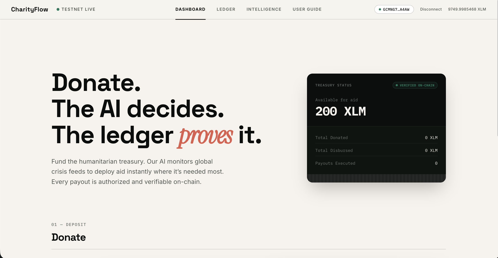
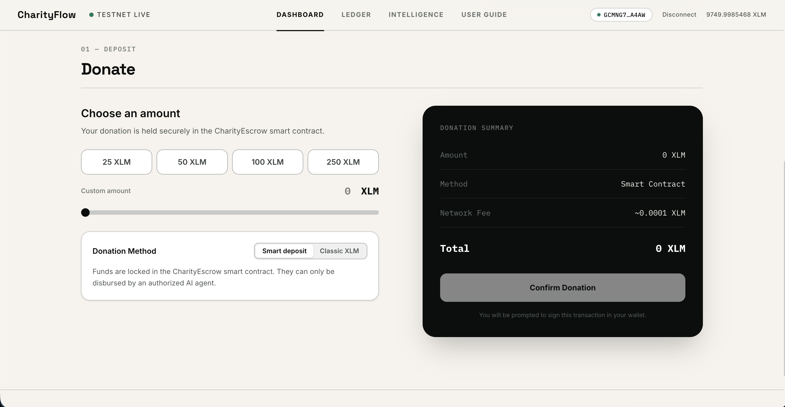
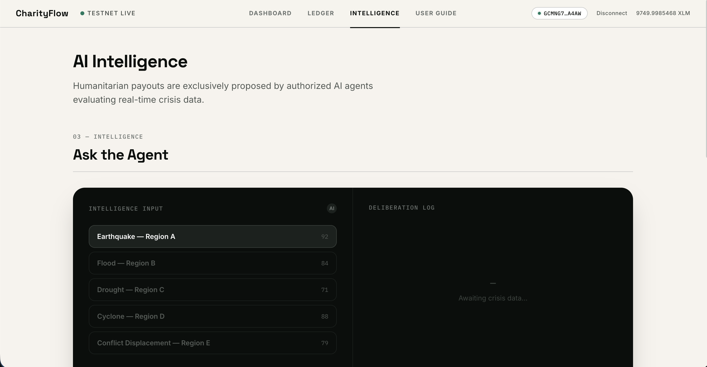
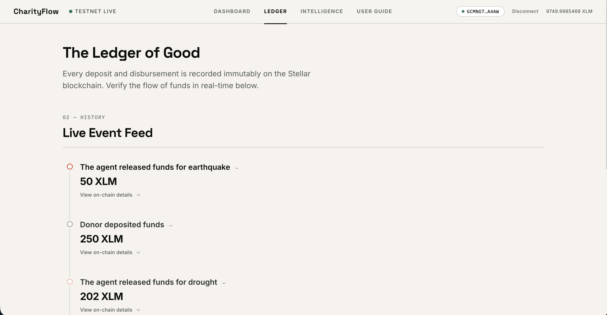
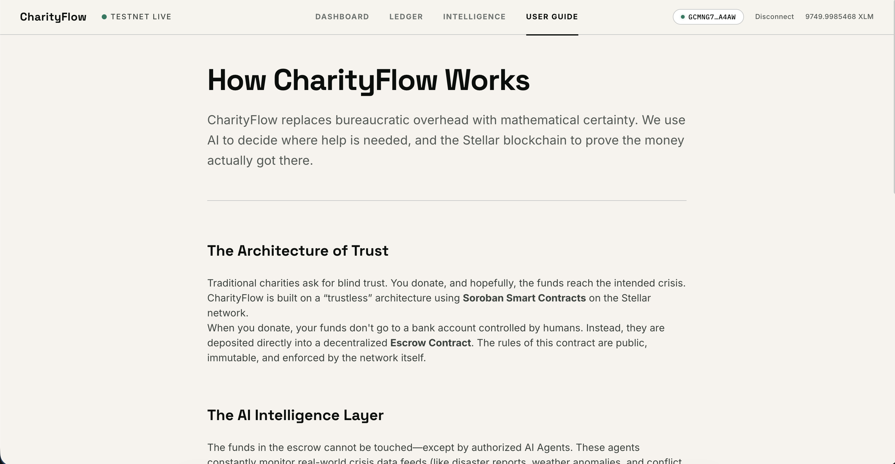
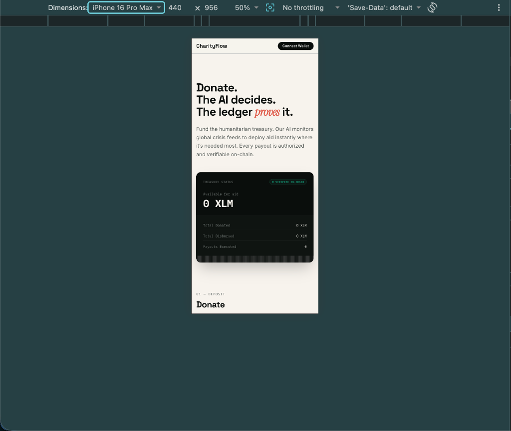

# 🌍 CharityFlow

> **Decentralized, AI-driven aid allocation and humanitarian escrow on Stellar (Soroban).**

CharityFlow replaces bureaucratic charity overhead with mathematical certainty. Donors fund a **`CharityEscrow`** Soroban smart contract. An autonomous, registered **AI agent** monitors real-time global crisis feeds and proposes transparent, auditable disbursements — every single action is recorded as an immutable on-chain event. Access control is enforced via a secondary contract, **`AgentRegistry`**, which the escrow invokes cross-contract before authorizing any payout.

[](https://charityflow-nine.vercel.app)
[](https://www.youtube.com/watch?v=lLl-5hIlJe4)
[](https://stellar.org)
[](https://soroban.stellar.org)
[](https://opensource.org/licenses/MIT)

---

## 📑 Table of Contents

- [⚡ Live Demo & Video Walkthrough](#-live-demo--video-walkthrough)
- [📜 Deployed Contracts & Testnet Verification](#-deployed-contracts--testnet-verification)
- [✨ Key Features](#-key-features)
- [🖼️ Product Tour](#️-product-tour)
- [⚙️ System Architecture](#-system-architecture)
- [🚀 Quick Start (Zero-Setup Simulation)](#-quick-start-zero-setup-simulation)
- [🌐 Live Testnet Deployment Guide](#-live-testnet-deployment-guide)
- [🛠️ Configuration & Environment](#️-configuration--environment)
- [🧪 Testing & CI/CD](#-testing--cicd)
- [✅ Submission Checklist & Verification](#-submission-checklist--criteria-verification)
- [🔐 Security & Trust Model](#-security--trust-model)
- [📄 License](#-license)

---

## ⚡ Live Demo & Video Walkthrough

- 🌐 **Live Web Application:** [https://charityflow-nine.vercel.app](https://charityflow-nine.vercel.app)
- 📺 **Video Walkthrough:** [https://www.youtube.com/watch?v=lLl-5hIlJe4](https://www.youtube.com/watch?v=lLl-5hIlJe4)

[](https://www.youtube.com/watch?v=lLl-5hIlJe4)

> Connect any supported Stellar wallet (Freighter, Albedo, Hana, or Rabet), deposit into the escrow, run the AI agent over a crisis scenario, and authorize a payout — all verified on the Stellar testnet ledger.

---

## 📜 Deployed Contracts & Testnet Verification

### Testnet Addresses

| Contract / Account | Role | Address / Explorer Link |
| :--- | :--- | :--- |
| **`AgentRegistry`** | Disburser Authorization | [`CC3U3E22XIYNWRQ7VAYVRAWAIENLAB4YLK7PGUC2KOL6VRG2Q5G6GZ2D`](https://stellar.expert/explorer/testnet/contract/CC3U3E22XIYNWRQ7VAYVRAWAIENLAB4YLK7PGUC2KOL6VRG2Q5G6GZ2D) |
| **`CharityEscrow`** | Funds Lockup & Payouts | [`CD6QUPH6HREZFJF6JVPEMDDI5OLKUMXTPVYFSAC7BMX376ZTFHTNEVCO`](https://stellar.expert/explorer/testnet/contract/CD6QUPH6HREZFJF6JVPEMDDI5OLKUMXTPVYFSAC7BMX376ZTFHTNEVCO) |
| **NGO Recipient** | Aid Beneficiary Wallet | [`GBPH6W2GR5QPSWJIJUJEHLQP3G7AISRJTRSIDOQKNUSOJOXW37BEPLBU`](https://stellar.expert/explorer/testnet/account/GBPH6W2GR5QPSWJIJUJEHLQP3G7AISRJTRSIDOQKNUSOJOXW37BEPLBU) |

### Verified On-Chain Transactions

The complete **Donate → AI Evaluate → Disburse** flow recorded on the Stellar Testnet:

| Action | Amount | Ledger Index | Verified Transaction Hash |
| :--- | :--- | :--- | :--- |
| **Deposit (Escrow)** | 202 XLM | 4171863 | [`5ae70e27…102c9c`](https://stellar.expert/explorer/testnet/tx/5ae70e27febf59609e8370aa67691430c336754f5db1b82bdc4a4dbf90102c9c) |
| **Payout (AI Agent)** | **202 XLM** | **4171958** | [`902c416a…27f8b1`](https://stellar.expert/explorer/testnet/tx/902c416a7366bd5e79301f3923206fc37085fac0c1780a46e4d3cf754827f8b1) |

*The `202 XLM` deposit was fully authorized via cross-contract verification and disbursed by the AI agent to the NGO beneficiary address.*

---

## ✨ Key Features

- **Level 1 — Dual Donation Methods:** Classic XLM payments and native Soroban contract deposits with real-time balance tracking.
- **Level 2 — AI-Driven Disbursal:** AI crisis agent analyzes severity scores and proposes disbursement parameters. Only agents authorized in `AgentRegistry` can trigger payouts (`is_agent` cross-contract check).
- **Level 3 — Real-Time Transparency:** Live on-chain event streaming (Deposit/Payout), full per-step transaction lifecycle UI (Pending → Signed → Broadcasted → Success/Error), and Gemini AI reasoning engine with offline rule-based fallback.
- **Multi-Wallet Support:** Seamless connection with Freighter, Albedo, Hana, and Rabet wallets via `@creit.tech/stellar-wallets-kit`.
- **Zero-Config Simulation Mode:** Full local Soroban simulation backed by `localStorage` — runs out of the box for testing and demos without requiring network funds.
- **Modern Responsive UI:** Glassmorphism design system built with Tailwind CSS, micro-interactions, and mobile responsiveness.

---

## 🖼️ Product Tour

### 1. Dashboard & Live Treasury Status
*Live overview of escrow reserves, historical donations, disbursed totals, and wallet status.*


### 2. Operations Console & Smart Donation
*Intuitive donation interface supporting both Soroban smart contract deposits and classic XLM transfers.*


### 3. AI Crisis Agent & Deliberation Engine
*Interactive crisis simulator where AI evaluates situational severity, explains allocation logic, and prepares disbursements.*


### 4. The Ledger of Good (Live Event Feed)
*Real-time stream of all on-chain contract events with expandable transaction hashes and metadata.*


### 5. User Guide & Architecture of Trust
*In-app interactive documentation explaining trustless smart contract governance and automated aid.*


### 6. Mobile Responsive Interface
*Optimized mobile-first design with touch-friendly controls, responsive modals, and real-time ledger updates.*
<p align="center">
  
</p>

---

## ⚙️ System Architecture

```
┌─────────────────┐       ┌────────────────────────┐       ┌─────────────────┐
│   Donor Wallet  │ ───>  │  CharityEscrow Contract │ ───>  │  NGO Beneficiary│
│ (Freighter/etc) │       │   (Holds & Locks Funds)│       │   (Aid Receipt) │
└─────────────────┘       └───────────┬────────────┘       └─────────────────┘
                                      │
                         Cross-Contract Auth Check
                               (`is_agent`)
                                      │
                                      ▼
┌─────────────────┐       ┌────────────────────────┐
│ AI Crisis Agent │ ───>  │  AgentRegistry Contract│
│ (Gemini Engine) │       │  (Role-Based Security) │
└─────────────────┘       └────────────────────────┘
```

### Directory Structure

```
src/
├── config.js                 # Env-driven configuration + live/simulation toggle
├── context/AppContext.jsx    # Global state (wallet, escrow, events, toasts)
├── components/               # UI components (WalletConnect, EscrowConsole, CrisisSimulation...)
├── contracts/
│   ├── escrowClient.js       # Unified escrow client (Simulation + Soroban RPC)
│   └── registryClient.js     # Unified registry client (Simulation + Soroban RPC)
├── pages/                    # Multi-page routing (HomePage, LedgerPage, IntelligencePage...)
└── utils/
    ├── stellar.js            # Stellar Wallets Kit, Horizon client, Soroban RPC
    ├── simulation.js         # In-browser Soroban simulator (localStorage)
    └── gemini.js             # AI crisis evaluation (Gemini API + rule-based fallback)

contracts/
├── agent-registry/           # AgentRegistry Soroban contract (disburser whitelist)
└── charity-escrow/           # CharityEscrow Soroban contract (cross-contract escrow)
```

---

## 🚀 Quick Start (Simulation Mode)

Run the entire application locally with zero setup, zero network dependencies, and no wallet extension requirements:

```bash
# 1. Install dependencies
npm install

# 2. Start the development server
npm run dev
```

1. Open `http://localhost:5173`.
2. Click **Connect Wallet** (mock identity generated or real testnet wallet detected).
3. Use the **＋100 XLM demo funds** button on the Dashboard to top up your balance.
4. Test deposits, run crisis scenarios, and execute payouts locally.

---

## 🌐 Live Testnet Deployment Guide

### Prerequisites
- Node.js (v18+) & Rust with `wasm32v1-none` target
- [Stellar CLI](https://developers.stellar.org/docs/tools/developer-tools/cli/install-and-build) installed (`stellar --version`)
- A funded Stellar Testnet account ([Stellar Friendbot](https://friendbot.stellar.org))

### 1. Build Smart Contracts

```bash
cd contracts/agent-registry
stellar contract build

cd ../charity-escrow
stellar contract build
```

> **Note:** `CharityEscrow` imports the registry wasm spec via `contractimport!`. If you modify `agent-registry`, rebuild and copy the updated wasm:
> `cp target/wasm32v1-none/release/agent_registry.wasm charity-escrow/specs/`

### 2. Deploy Contracts to Testnet

```bash
SOURCE="<YOUR_TESTNET_SECRET_KEY>"

# Deploy AgentRegistry
stellar contract deploy \
  --wasm target/wasm32v1-none/release/agent_registry.wasm \
  --source-account "$SOURCE" \
  --network testnet \
  --alias agent-registry

# Deploy CharityEscrow
stellar contract deploy \
  --wasm target/wasm32v1-none/release/charity_escrow.wasm \
  --source-account "$SOURCE" \
  --network testnet \
  --alias charity-escrow
```

### 3. Initialize Contracts & Set Roles

```bash
REGISTRY=$(stellar contract id --alias agent-registry)
ESCROW=$(stellar contract id --alias charity-escrow)
XLM_TOKEN=$(stellar contract id asset --asset native --network testnet)
ADMIN="<YOUR_TESTNET_PUBLIC_KEY>"
AI_AGENT="GCYXK5W4GFXTILMV3RHAB37ED26RRXY3RKXY5VDE5Y7VT53U3ZQPU7HQ"

# 1. Initialize Registry
stellar contract invoke --id "$REGISTRY" --source-account "$SOURCE" --network testnet \
  -- initialize --admin "$ADMIN"

# 2. Authorize AI Agent
stellar contract invoke --id "$REGISTRY" --source-account "$SOURCE" --network testnet \
  -- add_agent --admin "$ADMIN" --agent "$AI_AGENT"

# 3. Initialize Escrow with Registry & Native XLM Token
stellar contract invoke --id "$ESCROW" --source-account "$SOURCE" --network testnet \
  -- initialize --admin "$ADMIN" --registry "$REGISTRY" --token "$XLM_TOKEN"
```

### 4. Configure Frontend

Create `.env` based on `.env.example`:

```env
VITE_REGISTRY_CONTRACT_ID=CC3U3E22XIYNWRQ7VAYVRAWAIENLAB4YLK7PGUC2KOL6VRG2Q5G6GZ2D
VITE_ESCROW_CONTRACT_ID=CD6QUPH6HREZFJF6JVPEMDDI5OLKUMXTPVYFSAC7BMX376ZTFHTNEVCO
VITE_NGO_WALLET=GBPH6W2GR5QPSWJIJUJEHLQP3G7AISRJTRSIDOQKNUSOJOXW37BEPLBU
```

Run `npm run dev` — the header indicator will switch to 🟢 **TESTNET LIVE**.

---

## 🛠️ Configuration & Environment

| Environment Variable | Default Value | Description |
| :--- | :--- | :--- |
| `VITE_HORIZON_URL` | `https://horizon-testnet.stellar.org` | Stellar Horizon RPC endpoint for accounts/balances |
| `VITE_SOROBAN_RPC_URL` | `https://soroban-testnet.stellar.org` | Soroban RPC endpoint for contract simulations & events |
| `VITE_NETWORK_PASSPHRASE` | `Test SDF Network ; September 2015` | Stellar network passphrase |
| `VITE_REGISTRY_CONTRACT_ID` | — | Deployed `AgentRegistry` Soroban contract address |
| `VITE_ESCROW_CONTRACT_ID` | — | Deployed `CharityEscrow` Soroban contract address |
| `VITE_ESCROW_WALLET` | — | Destination address for fallback classic payments |
| `VITE_AGENT_PUBLIC_KEY` | Demo keypair | Public address of the AI disburser |
| `VITE_AGENT_SECRET_KEY` | Demo keypair | Testnet-only signing key for browser simulation |
| `VITE_NGO_WALLET` | Demo NGO address | Default beneficiary wallet for relief disbursements |
| `VITE_GEMINI_API_KEY` | — | Optional Google Gemini API key for live AI reasoning |

---

## 🧪 Testing & CI/CD

### Automated Test Suite

```bash
# Run Rust Soroban contract tests (16 unit & integration tests)
npm run test:contracts

# Run frontend end-to-end flow tests (Vitest + Testing Library)
npm test

# Run ESLint check
npm run lint

# Build production bundle
npm run build
```

#### Frontend Test Execution Output (4 Passing Tests)
```
 ✓ tests/frontend.test.jsx (4 tests)
     ✓ renders the app shell with treasury and wallet prompt
     ✓ rejects a donation larger than the donor balance
     ✓ runs the full flow: connect → donate → AI proposes → agent disburses
     ✓ validates Soroban contract ID format correctly

 Test Files  1 passed (1)
      Tests  4 passed (4)
   Duration  2.8s
```

### CI/CD Pipeline

The repository includes GitHub Actions CI (`.github/workflows/ci-cd.yml`) that validates on every push and PR:
- **Rust Contracts Job:** `cargo test --workspace` and WASM release build verification.
- **Frontend Job:** Dependency installation, linting, Vitest frontend flow execution, and production build.

---

## ✅ Submission Checklist & Criteria Verification

| Requirement | Status | Reference / Verification Proof |
| :--- | :---: | :--- |
| **Public GitHub Repository** | ✅ Verified | [github.com/Sampad2006/charityflow](https://github.com/Sampad2006/charityflow) |
| **Complete Documentation** | ✅ Verified | Comprehensive [README.md](README.md) with architecture, setup, and testnet guides |
| **10+ Meaningful Commits** | ✅ Verified | **43+ commits** recorded across repository history |
| **Live Demo Link** | ✅ Verified | [https://charityflow-nine.vercel.app](https://charityflow-nine.vercel.app) |
| **Contract Deployment Addresses** | ✅ Verified | `AgentRegistry`: [`CC3U...`](https://stellar.expert/explorer/testnet/contract/CC3U3E22XIYNWRQ7VAYVRAWAIENLAB4YLK7PGUC2KOL6VRG2Q5G6GZ2D) <br/> `CharityEscrow`: [`CD6Q...`](https://stellar.expert/explorer/testnet/contract/CD6QUPH6HREZFJF6JVPEMDDI5OLKUMXTPVYFSAC7BMX376ZTFHTNEVCO) |
| **Verified Contract Call Tx Hashes** | ✅ Verified | Deposit: [`5ae70e27…102c9c`](https://stellar.expert/explorer/testnet/tx/5ae70e27febf59609e8370aa67691430c336754f5db1b82bdc4a4dbf90102c9c) <br/> AI Payout: [`902c416a…27f8b1`](https://stellar.expert/explorer/testnet/tx/902c416a7366bd5e79301f3923206fc37085fac0c1780a46e4d3cf754827f8b1) |
| **Mobile Responsive UI** | ✅ Verified | [Mobile View Screenshot](docs/screenshots/mobile.png) • Fluid mobile-first Tailwind design |
| **CI/CD Pipeline Running** | ✅ Verified | [.github/workflows/ci-cd.yml](.github/workflows/ci-cd.yml) |
| **Test Output (3+ passing tests)** | ✅ Verified | **4/4 passing Vitest tests** + 16 Rust contract tests |
| **Demo Video Link (1–2 mins)** | ✅ Verified | [YouTube Walkthrough](https://www.youtube.com/watch?v=lLl-5hIlJe4) |

---

## 🔐 Security & Trust Model

- **On-Chain Access Control:** All payout requests must pass cross-contract validation against `AgentRegistry`. A compromised frontend or unauthorized caller cannot disburse funds.
- **Non-Custodial Escrow:** Funds remain locked in the `CharityEscrow` smart contract until verified criteria are met.
- **Key Management:** In a production deployment, AI agent keys reside in secure backend key management services (KMS/HSM). Client-side keys are provided strictly for local testnet exploration.
- **Zero Secrets in Repository:** No production private keys or API keys are committed. All secrets use environment variables.

---

## 📄 License

This project is licensed under the [MIT License](LICENSE).